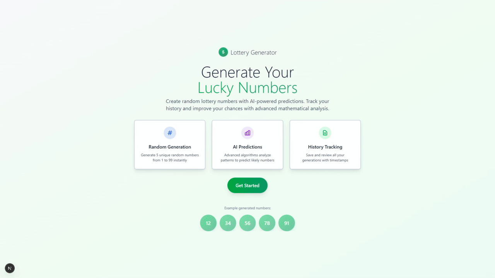

# 🎲 Intelligent Lottery Predictor

An advanced, AI-powered lottery number generator and prediction system built with Next.js, React, and TypeScript. Features sophisticated prediction algorithms, comprehensive history tracking, manipulation detection, behavioral pattern analysis, and automatic synchronization with official lottery results.

## 📸 Screenshots



## ✨ Features

### 🎯 Core Functionality

- **Smart Number Generation**: Generate random lottery numbers (1-99) with intelligent selection
- **Dual Prediction Methods**:
  - **History-Based Prediction**: Advanced algorithm using:
    - Exponential decay recency analysis
    - Frequency and gap analysis
    - Monte Carlo simulation (100 iterations)
    - Pair frequency analysis
    - Range distribution optimization
    - Behavioral pattern recognition
    - User profile adaptation
    - Recent prediction avoidance
  - **Analytics-Based Prediction**: Statistical approach using:
    - Hot numbers (most frequent)
    - Recent trends (last 10/30 generations)
    - Cold numbers (least frequent)
    - Most common pairs
    - Range and sum distribution
    - Digit ending patterns
- **Auto Predict**: Choose between History or Analytics prediction methods
- **Manual Selection**: Choose your own numbers with an intuitive interface

### 📊 History & Analytics

- **Complete History Tracking**: View all generated and predicted numbers
- **Manipulation Detection**: Each generation shows a manipulation confidence score (0-100%)
  - Color-coded badges (Green/Yellow/Red)
  - Detected patterns displayed on hover
  - Confidence level indicator
- **Match Statistics**: Track prediction accuracy with detailed statistics
  - Total predictions
  - Average matches
  - Accuracy percentage
  - Perfect matches count
- **Comprehensive Analytics Page**: Detailed statistical analysis including:
  - 🔥 Hot Numbers (most frequent)
  - ❄️ Cold Numbers (least frequent)
  - Recent Trends (last 10/30 generations)
  - Most Common Pairs
  - Range Distribution with visual charts
  - Odd/Even Distribution
  - Sum Distribution statistics
  - Digit Ending Patterns
  - Consecutive Pattern Analysis
- **Pagination**: Efficient browsing through history records
- **Bulk Operations**: Select and delete multiple records at once
- **Custom Modals**: Beautiful confirmation dialogs (no browser alerts)

### 🔄 Data Management

- **Automatic Sync**: Sync with official lottery results from external sources
- **Customizable Sync Period**: Select sync range from 1 week to 51 years
- **Export/Import**: Backup and restore your history data in JSON format
- **Data Validation**: Ensures data integrity on import
- **Automatic Manipulation Scoring**: All imported/synced data gets manipulation scores calculated
- **Logging System**: Comprehensive logging to both console and log files (`logs/app-YYYY-MM-DD.log`)

### 🎨 User Experience

- **Modern UI**: Beautiful, responsive design with dark mode support
- **Confetti Celebrations**: Visual feedback when numbers match
- **Sound Effects**: Celebratory sounds for wins, with mute functionality
- **Responsive Design**: Works seamlessly on desktop, tablet, and mobile
- **Fixed Sidebar Navigation**: Easy access to all features
- **Custom Modals**: Elegant confirmation dialogs with light overlay
- **Loading States**: Clear visual feedback during operations
- **Empty States**: Helpful messages when no data is available

### ⚙️ Settings & Configuration

- **Sound Controls**: Toggle sound effects on/off
- **Custom Sync URL**: Configure lottery data source
- **Data Management**: Export, import, and sync lottery results

## 🚀 Getting Started

### Prerequisites

- [Bun](https://bun.sh/) (latest version)
- Node.js 18+ (if not using Bun's built-in Node.js)

### Installation

1. **Clone the repository**

   ```bash
   git clone <repository-url>
   cd lottery-generator
   ```

2. **Install dependencies**

   ```bash
   bun install
   ```

3. **Run the development server**

   ```bash
   bun run dev
   ```

4. **Open your browser**
   Navigate to [http://localhost:3000](http://localhost:3000)

### Building for Production

```bash
# Build the application
bun run build

# Start the production server
bun run start
```

## 📁 Project Structure

```
lottery-generator/
├── src/
│   ├── app/                    # Next.js app directory
│   │   ├── api/               # API routes
│   │   │   ├── history/      # Fetch history
│   │   │   ├── predict/      # History-based prediction
│   │   │   ├── predict-analytics/ # Analytics-based prediction
│   │   │   ├── analytics/    # Analytics data endpoint
│   │   │   ├── save/         # Save generation
│   │   │   ├── delete/        # Delete records
│   │   │   ├── clear/        # Clear all records
│   │   │   ├── sync-lottery/ # Sync external data
│   │   │   ├── import/       # Import history
│   │   │   └── info/         # App information
│   │   ├── play/             # Number selection page
│   │   ├── generate/         # Results & statistics page
│   │   ├── history/          # History viewing page
│   │   ├── analyze/          # Analytics & statistics page
│   │   ├── settings/         # Settings & data management
│   │   └── info/             # App information page
│   ├── components/           # React components
│   │   ├── Sidebar.tsx       # Navigation sidebar
│   │   ├── Logo.tsx          # App logo
│   │   ├── LandingPage.tsx   # Landing page component
│   │   └── ConfirmModal.tsx  # Custom confirmation modal
│   ├── contexts/             # React contexts
│   │   └── SoundContext.tsx  # Sound management
│   ├── hooks/                # Custom React hooks
│   │   ├── useHistory.ts     # History management
│   │   └── useNumberSelection.ts # Number selection logic
│   ├── lib/                  # Utility libraries
│   │   ├── generations.ts    # File I/O operations
│   │   ├── prediction.ts     # History-based prediction algorithm
│   │   ├── analyticsPrediction.ts # Analytics-based prediction
│   │   ├── manipulationDetection.ts # Detection & behavioral analysis
│   │   ├── logger.ts         # Logging system
│   │   ├── utils.ts          # General utilities
│   │   └── numberColors.ts   # Number styling utilities
│   └── types/                # TypeScript types
│       └── generation.ts     # Data models
├── public/
│   ├── icons/                # App icons
│   └── sounds/               # Sound effects
├── data/                     # Generated data (gitignored)
│   └── generations.json      # History storage
├── logs/                     # Log files (gitignored)
│   └── app-YYYY-MM-DD.log    # Daily log files
├── PREDICTION.md             # Detailed algorithm documentation
└── package.json
```

## 🛠️ Technology Stack

- **Framework**: [Next.js 14](https://nextjs.org/) (App Router)
- **UI Library**: [React 18](https://react.dev/)
- **Styling**: [Tailwind CSS](https://tailwindcss.com/)
- **Language**: [TypeScript](https://www.typescriptlang.org/)
- **Package Manager**: [Bun](https://bun.sh/)
- **Effects**: [canvas-confetti](https://github.com/catdad/canvas-confetti)

## 📖 Usage Guide

### Generating Numbers

1. Navigate to the **Play** page
2. Choose your prediction method:
   - **Predict (History)**: Uses advanced behavioral analysis and manipulation detection
   - **Predict (Analytics)**: Uses statistical patterns (hot numbers, trends, etc.)
   - **Manual Selection**: Choose 5 numbers (1-99) yourself
3. Click **Play** to generate results
4. View matches, statistics, and celebrate with confetti!

### Viewing History

1. Go to the **History** page
2. Browse through all past generations
3. See matched numbers highlighted
4. View manipulation scores for each generation:
   - **Green (0-39%)**: Likely random
   - **Yellow (40-69%)**: Some patterns detected
   - **Red (70-100%)**: Strong manipulation indicators
5. Hover over scores to see detected patterns
6. Delete individual or multiple records using custom modals

### Analyzing Data

1. Navigate to the **Analyze** page
2. View comprehensive statistics:
   - Hot and cold numbers
   - Recent trends
   - Most common pairs
   - Range and distribution charts
   - Sum statistics
   - Odd/even patterns
3. Use insights to inform your number selection

### Syncing Lottery Results

1. Open **Settings**
2. Configure the sync URL (default: official lottery source)
3. Select the time range (1 week to 51 years)
4. Click **Sync Lottery Results**
5. View sync log and statistics

### Exporting/Importing Data

1. In **Settings**, scroll to **Export & Import**
2. **Export**: Download your history as JSON
3. **Import**: Upload a JSON file to restore history

## 🧠 Prediction Algorithms

### History-Based Prediction

The primary prediction algorithm uses 9 phases of analysis:

1. **Exponential Decay Recency**: More recent draws have exponentially higher weight (`e^(-0.1t)`)
2. **Frequency Analysis**: Tracks number appearance frequency with normalization
3. **Gap Analysis**: Identifies overdue numbers (gap > 120% of expected return)
4. **Pair Frequency**: Analyzes number combinations that appear together
5. **Range Distribution**: Ensures balanced number distribution across 5 ranges
6. **Behavioral Pattern Analysis**: Adapts to user's selection patterns
7. **Recent Prediction Avoidance**: Prevents predicting similar numbers to recent predictions
8. **Monte Carlo Simulation**: Generates 100 candidate sets and scores them
9. **Final Selection**: Validates and selects best combination

### Analytics-Based Prediction

Statistical approach using 8 strategies:

1. **Hot Numbers**: Top 15 most frequent numbers (weighted by frequency)
2. **Recent Trends**: Last 10 generations (high weight) and last 30 (medium weight)
3. **Cold Numbers**: Least frequent numbers for variety
4. **Common Pairs**: Numbers that frequently appear together
5. **Range Distribution**: Boosts under-represented ranges
6. **Sum Optimization**: Targets optimal sum based on historical average
7. **Digit Patterns**: Popular digit endings
8. **Odd/Even Balance**: Maintains statistical balance

### Manipulation Detection

Comprehensive detection system with multiple tests:

**Statistical Tests:**

- **Runs Test**: Detects non-random odd/even or high/low patterns
- **Chi-Square Test**: Checks deviation from uniform distribution
- **Serial Correlation**: Detects patterns in consecutive draws

**Behavioral Patterns:**

- Consecutive number avoidance
- Spread-out number preference
- Middle-range preference (avoiding extremes)
- Digit-ending preferences
- Visual/aesthetic patterns (balanced odd/even, round numbers)

**Scoring:**

- Weighted combination of all tests (0-100%)
- Confidence increases with more data
- Patterns displayed in history page

See [PREDICTION.md](./PREDICTION.md) for detailed algorithm documentation.

## 🎨 Design Philosophy

- **Green/Emerald Theme**: Calming, professional color scheme
- **Gradient Backgrounds**: Subtle gradients for visual depth
- **Strong Borders**: Clear visual separation
- **Responsive**: Mobile-first design approach
- **Accessibility**: Proper contrast and semantic HTML

## 📝 API Endpoints

- `GET /api/history` - Fetch all generations
- `GET /api/predict` - Get history-based AI-predicted numbers
- `GET /api/predict-analytics` - Get analytics-based predicted numbers
- `GET /api/analytics` - Get comprehensive analytics data
- `POST /api/save` - Save a new generation (calculates manipulation score)
- `DELETE /api/delete` - Delete specific records
- `DELETE /api/clear` - Delete all records
- `GET /api/sync-lottery` - Sync external lottery data (calculates manipulation scores)
- `POST /api/import` - Import history data (calculates manipulation scores)
- `GET /api/info` - Get app information

## 🔒 Data Storage

- History is stored locally in `data/generations.json`
- Logs are stored in `logs/app-YYYY-MM-DD.log` (automatically created)
- Data format:
  ```json
  {
    "id": "unique-id",
    "numbers": [1, 2, 3, 4, 5],
    "date": "ISO-date-string",
    "predictedNumbers": [1, 2, 3, 4, 5], // optional
    "manipulationScore": {
      // automatically calculated
      "score": 45,
      "confidence": 75,
      "patterns": [
        "Non-random odd/even patterns",
        "Prefers middle-range numbers"
      ]
    }
  }
  ```

## 🚧 Development

### Running Linter

```bash
bun run lint
```

### Code Structure

The codebase follows best practices:

- **Modular**: Separated concerns with utilities, hooks, and components
- **Type-Safe**: Full TypeScript coverage
- **DRY**: Shared utilities and hooks reduce duplication
- **Maintainable**: Clear file structure and naming conventions
- **Logged**: Comprehensive logging system for debugging and monitoring

### Logging

- Logs are written to both server console and log files
- Log files are created automatically in `logs/` directory
- Daily rotation: `app-YYYY-MM-DD.log`
- Log levels: INFO, DEBUG, WARN, ERROR
- All prediction and detection operations are logged

### Key Features Implementation

- **Manipulation Detection**: Real-time calculation on save/import/sync
- **Behavioral Adaptation**: Predictions adapt based on detected patterns
- **Similarity Avoidance**: Prevents predicting similar numbers to recent predictions
- **Dual Prediction Methods**: Two distinct algorithms for different strategies

## 📚 Documentation

- **[PREDICTION.md](./PREDICTION.md)**: Comprehensive documentation of prediction algorithms and manipulation detection
  - Detailed explanation of all 9 phases of history-based prediction
  - Analytics-based prediction strategies
  - Statistical tests and behavioral pattern detection
  - User profile building and adaptation
  - Algorithm parameters and performance considerations

## 🔬 Advanced Features

### Manipulation Detection System

The application detects human manipulation patterns in number selection:

- **Statistical Tests**: Runs Test, Chi-Square, Serial Correlation
- **Behavioral Patterns**: Consecutive avoidance, spread preference, middle-range preference
- **Visual Patterns**: Odd/even balance, round numbers, repeated digits
- **Confidence Scoring**: 0-100% manipulation likelihood with pattern details

### User Profile Building

Tracks and learns from user behavior:

- Favorite number ranges and individual numbers
- Digit ending preferences
- Compensation patterns (high after low, etc.)
- Randomness strategy (avoids consecutive, prefers spread, etc.)

### Prediction Adaptation

- Adapts predictions based on detected manipulation patterns
- Avoids similar predictions to recent ones
- Balances statistical patterns with behavioral insights
- Optimizes for diversity and distribution

## 📄 License

This project is private and proprietary.

## 👤 Author

Built with ❤️ for intelligent lottery number prediction

---

**Note**: This application is for entertainment purposes only. Lottery outcomes are random, and no prediction system can guarantee wins. The manipulation detection and behavioral analysis are designed to understand user patterns, not to predict actual lottery outcomes.
